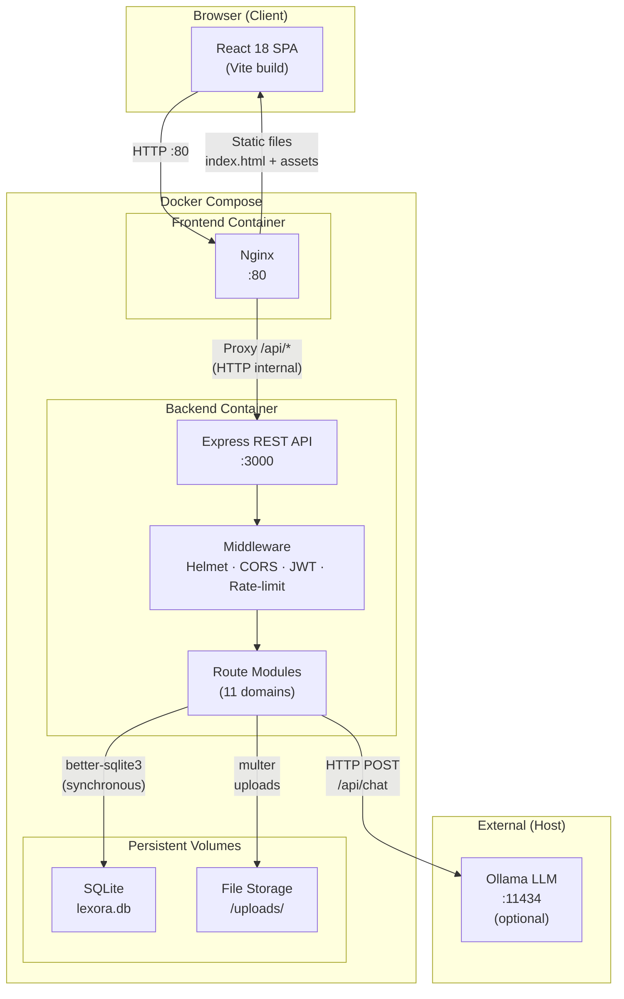
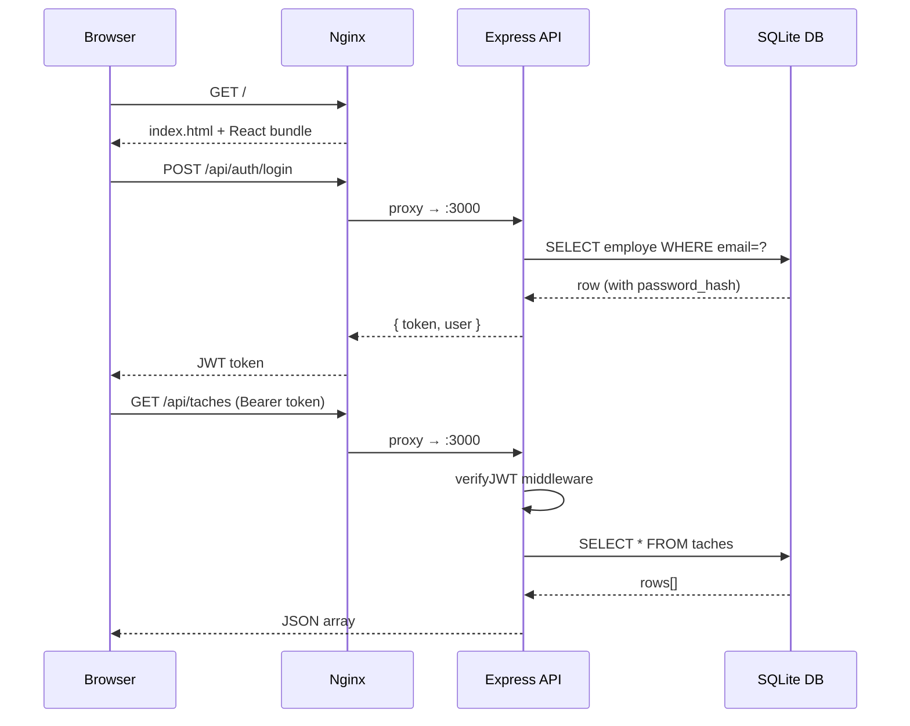
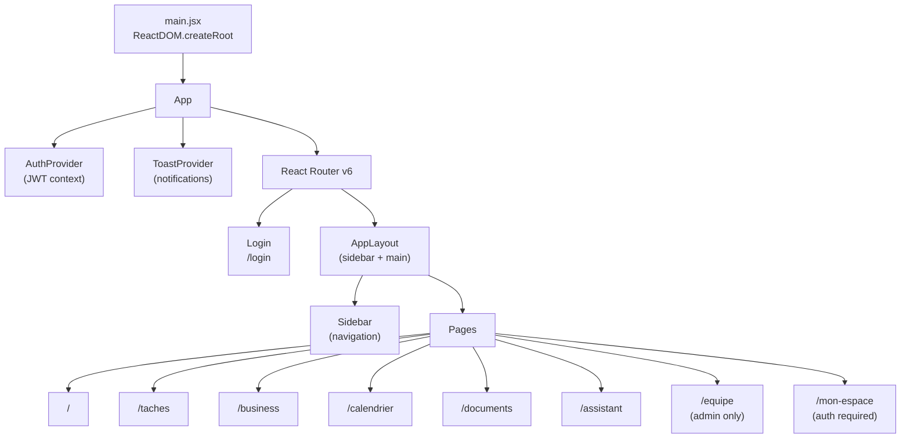
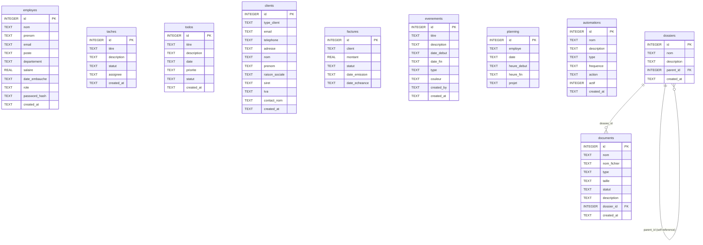

# Lexora — ERP Full-Stack Application

> **Holberton School Portfolio Project** — A full-stack Enterprise Resource Planning (ERP) web application for small teams: task management, CRM, invoicing, calendar, document vault, and AI assistant.

[](https://nodejs.org)
[](https://react.dev)
[](https://www.sqlite.org)
[](https://docs.docker.com/compose)
[](LICENSE)

---

## Table of Contents

- [Overview](#overview)
- [Features](#features)
- [Application Architecture](#application-architecture)
- [Database Diagram](#database-diagram)
- [Tech Stack](#tech-stack)
- [Quick Start](#quick-start)
  - [Docker (Recommended)](#docker-recommended)
  - [Local Development](#local-development)
- [Environment Variables](#environment-variables)
- [API Reference](#api-reference)
- [Project Structure](#project-structure)
- [Security](#security)
- [Team](#team)

---

## Overview

**Lexora** is a centralized workspace for small business operations. It replaces scattered tools with a single, integrated application:

- A unified **dashboard** with live KPIs (task count, invoice totals, pending items)
- **Task management** for project tracking and quick notes
- **CRM + Invoicing** for client and billing management
- **Interactive calendar** integrating events and staff schedules
- **Document vault** with folder hierarchy and drag-and-drop uploads
- **AI assistant** powered by a local LLM via Ollama
- **Admin panel** for employee directory, schedules, and automation rules

---

## Features

| Module | Description |
|--------|-------------|
| 📊 **Dashboard** | Animated KPI cards — task counts, invoice totals, pending items |
| ✅ **Tasks** | Project tasks (status, assignee) + quick sticky notes with priority |
| 💶 **Clients & Invoices** | Contact management + invoices with status tracking (pending / paid / cancelled) |
| 📅 **Calendar** | Month/week/day views, click-to-create events, staff schedule integration |
| 📁 **Document Vault** | Hierarchical folder tree, drag-and-drop upload, file download, 50 MB limit |
| 🤖 **AI Assistant** | Real-time chat with a local LLM (Ollama / llama3.2) |
| 👥 **Team (Admin)** | Employee directory, shift planning, automation rule management |

---

## Application Architecture

### High-Level Overview



### Request Flow



### Frontend Architecture



---

## Database Diagram



### Table Reference

| Table | Purpose | Key Fields |
|-------|---------|------------|
| `employes` | Employee directory + auth accounts | `email`, `role`, `password_hash` |
| `taches` | Project tasks | `titre`, `statut` (todo/in_progress/done), `assignee` |
| `todos` | Quick sticky notes | `titre`, `priorite`, `statut` |
| `clients` | Client contacts (individuals + companies) | `type_client`, `email`, `nom`/`raison_sociale` |
| `factures` | Invoices | `client`, `montant`, `statut` (en attente/payee/annulee) |
| `evenements` | Calendar events | `titre`, `date_debut`, `date_fin`, `type`, `couleur` |
| `planning` | Employee work schedules | `employe`, `date`, `heure_debut`, `heure_fin` |
| `automations` | Automation rules (admin) | `nom`, `action`, `actif` |
| `dossiers` | Document vault folders (tree via `parent_id`) | `nom`, `parent_id` |
| `documents` | Uploaded file metadata | `nom`, `nom_fichier`, `type`, `taille`, `dossier_id` |

---

## Tech Stack

### Backend

| Technology | Version | Role |
|-----------|---------|------|
| **Node.js** | 18 | JavaScript runtime |
| **Express** | 4 | HTTP server, REST API |
| **better-sqlite3** | 9+ | Synchronous SQLite driver |
| **jsonwebtoken** | 9 | JWT authentication |
| **bcryptjs** | 3 | Password hashing |
| **Multer** | 2 | Multipart file uploads |
| **Helmet** | 8 | HTTP security headers |
| **express-rate-limit** | 8 | Request rate limiting |
| **dotenv** | 16 | Environment configuration |

### Frontend

| Technology | Version | Role |
|-----------|---------|------|
| **React** | 18 | UI framework (SPA) |
| **Vite** | 5 | Build tool + dev server |
| **React Router** | 6 | Client-side routing |
| **react-big-calendar** | 1 | Interactive calendar component |
| **date-fns** | 4 | Date manipulation + fr locale |
| **CSS (vanilla)** | — | Custom design system (1,300+ lines) |

### Infrastructure

| Technology | Role |
|-----------|------|
| **Docker** + **Docker Compose** | Containerization (2 containers) |
| **Nginx (Alpine)** | Reverse proxy + static file server |
| **Docker volumes** | SQLite persistence + file uploads |
| **Ollama** (optional) | Local LLM for AI assistant |

---

## Quick Start

### Docker (Recommended)

**Prerequisites:** Docker and Docker Compose installed.

```bash
# 1. Clone the repository
git clone https://github.com/poloelo/Holberton-portfolio-projet.git
cd Holberton-portfolio-projet

# 2. Configure environment
#    lexora/.env is already pre-configured for Docker
#    Edit lexora/.env to set your own JWT_SECRET before production use

# 3. Start the application
docker compose up --build

# Application is available at http://localhost
```

**Default admin account:**
```
Email:    admin@lexora.fr
Password: Admin1234!
```

> **AI Assistant:** To enable the AI assistant, install [Ollama](https://ollama.ai) on your host:
> ```bash
> ollama pull llama3.2
> ollama serve
> ```

To stop:
```bash
docker compose down

# Remove volumes (WARNING: deletes all data)
docker compose down -v
```

---

### Local Development

**Prerequisites:** Node.js 18+, npm.

```bash
# Clone
git clone https://github.com/poloelo/Holberton-portfolio-projet.git
cd Holberton-portfolio-projet

# Backend
cd lexora/backend
npm install
npm run dev          # starts with node --watch (auto-reload) on :3000

# Frontend (new terminal)
cd lexora/frontend
npm install
npm run dev          # Vite dev server on http://localhost:5173
```

The Vite dev proxy (`vite.config.js`) automatically forwards `/api/*` to `http://localhost:3000`.

---

## Environment Variables

File location: `lexora/.env`

| Variable | Default | Description |
|----------|---------|-------------|
| `PORT` | `3000` | Express server port |
| `DB_PATH` | `./lexora.db` | SQLite file path |
| `JWT_SECRET` | *(required)* | Secret key for signing JWT tokens |
| `ADMIN_KEY` | *(required)* | Secret key for admin API routes |
| `ALLOWED_ORIGINS` | `http://localhost` | Comma-separated CORS allowed origins |
| `ADMIN_EMAIL` | — | Seeds an admin account on first startup |
| `ADMIN_PASSWORD` | — | Password for the seeded admin account |
| `OLLAMA_URL` | `http://localhost:11434` | Ollama server URL |
| `OLLAMA_MODEL` | `llama3.2` | LLM model used by the AI assistant |

> **Security:** Never commit your `.env` file. It is listed in `.gitignore`.

---

## API Reference

All endpoints are prefixed with `/api`.

### Health
```
GET  /api/health         → { status: 'ok', timestamp }
```

### Authentication
```
POST /api/auth/login     → { token, user }   Body: { email, password }
```

### Tasks
```
GET    /api/taches       → Task[]
POST   /api/taches       → Task      Body: { titre*, description, statut, assignee }
PUT    /api/taches/:id   → Task      Body: { titre*, description, statut, assignee }
DELETE /api/taches/:id   → { success: true }
```

### Quick Notes (Todos)
```
GET    /api/todos        → Todo[]
POST   /api/todos        → Todo     Body: { titre*, description, date, priorite, statut }
PUT    /api/todos/:id    → Todo
DELETE /api/todos/:id    → { success: true }
```

### Clients
```
GET    /api/clients      → Client[]
GET    /api/clients/:id  → Client
POST   /api/clients      → Client   Body: { email*, nom* | raison_sociale*, type_client, ... }
PUT    /api/clients/:id  → Client
DELETE /api/clients/:id  → { message }
```

### Invoices
```
GET    /api/factures     → Invoice[]
POST   /api/factures     → Invoice  Body: { client*, montant*, statut, date_emission, date_echeance }
PUT    /api/factures/:id → Invoice
DELETE /api/factures/:id → { success: true }
```

### Calendar Events
```
GET    /api/evenements      → Event[]
GET    /api/evenements/:id  → Event
POST   /api/evenements      → Event  Body: { titre*, date_debut*, date_fin, type, description }
PUT    /api/evenements/:id  → Event
DELETE /api/evenements/:id  → { success: true }
```

### Planning (Staff Schedules)
```
GET    /api/planning      → Schedule[]
POST   /api/planning      → Schedule  Body: { employe*, date*, heure_debut*, heure_fin*, projet }
PUT    /api/planning/:id  → Schedule
DELETE /api/planning/:id  → { success: true }
```

### Document Vault
```
GET    /api/documents                → Document[]  (query: ?dossier_id=)
POST   /api/documents/upload         → Document    Body: multipart/form-data { file, dossier_id }
GET    /api/documents/:id/download   → File stream
DELETE /api/documents/:id            → { success: true }

GET    /api/documents/dossiers       → Folder[]
POST   /api/documents/dossiers       → Folder  Body: { nom*, description, parent_id }
DELETE /api/documents/dossiers/:id   → { success: true }  (recursive delete)
```

### Employees — Admin (requires `Authorization: Bearer <token>`)
```
GET    /api/employes      → Employee[]
GET    /api/employes/:id  → Employee
POST   /api/employes      → Employee  Body: { nom*, email*, password*, prenom, poste }
PUT    /api/employes/:id  → Employee
DELETE /api/employes/:id  → { success: true }
```

### Automations — Admin (requires `Authorization: Bearer <token>`)
```
GET    /api/automations      → Automation[]
POST   /api/automations      → Automation  Body: { nom*, action* }
PUT    /api/automations/:id  → Automation
DELETE /api/automations/:id  → { success: true }
```

### AI Assistant
```
POST /api/assistant   Body: { prompt* }   → { response }
```

---

## Project Structure

```
Holberton-portfolio-projet/
├── .env.example                    # Environment template (copy to lexora/.env)
├── README.md                       # This file
├── QA_REPORT.md                    # Security & integration QA report
├── docker-compose.yml              # Docker orchestration (backend + frontend)
├── Dockerfile.backend              # Node.js 18 slim image
├── Dockerfile.frontend             # Multi-stage: Vite build → Nginx serve
├── nginx.conf                      # Reverse proxy + SPA routing config
└── lexora/
    ├── .env                        # Environment variables (not committed)
    ├── .gitignore
    ├── package.json                # Shared workspace dependencies
    ├── backend/
    │   ├── env.js                  # Loads dotenv before any other module
    │   ├── index.js                # Express entry point — mounts all routes
    │   ├── package.json
    │   ├── middleware/
    │   │   └── auth.js             # JWT verification middleware
    │   ├── models/
    │   │   └── db.js               # SQLite init, schema creation, admin seed
    │   ├── routes/                 # One file per business domain
    │   │   ├── auth.js             # Login → JWT
    │   │   ├── taches.js           # Project task CRUD
    │   │   ├── todos.js            # Quick note CRUD
    │   │   ├── clients.js          # Client contact CRUD
    │   │   ├── factures.js         # Invoice CRUD
    │   │   ├── evenements.js       # Calendar event CRUD
    │   │   ├── planning.js         # Staff schedule CRUD
    │   │   ├── employes.js         # Employee CRUD (admin, JWT required)
    │   │   ├── automations.js      # Automation rule CRUD (admin, JWT required)
    │   │   ├── documents.js        # File vault: folders + upload/download
    │   │   └── assistant.js        # Proxy to Ollama LLM
    │   ├── services/
    │   │   └── ollamaService.js    # HTTP client for Ollama
    │   └── uploads/                # Uploaded files (gitignored, Docker volume)
    └── frontend/
        ├── index.html
        ├── vite.config.js          # Vite build config + /api/* dev proxy
        ├── package.json
        └── src/
            ├── main.jsx            # ReactDOM.createRoot + BrowserRouter
            ├── App.jsx             # Sidebar + route definitions + guards
            ├── index.css           # Complete design system (1,300+ lines)
            ├── contexts/
            │   ├── AuthContext.jsx  # JWT state (login, logout, authHeaders)
            │   └── ToastContext.jsx # Global toast notifications
            ├── components/
            │   └── Tabs.jsx         # Reusable tabbed panel component
            └── pages/
                ├── Login.jsx        # Authentication page (full-screen)
                ├── Dashboard.jsx    # KPI overview with animated counters
                ├── Taches.jsx       # Tasks + quick notes (tabbed)
                ├── ClientsFactures.jsx  # CRM + invoicing (tabbed)
                ├── Calendrier.jsx   # Interactive calendar (react-big-calendar)
                ├── Coffre_fort.jsx  # Document vault with folder navigation
                ├── Assistant.jsx    # AI chat interface
                ├── Equipe.jsx       # Admin panel (employees, planning, automations)
                └── MonEspace.jsx    # Employee personal space + schedule view
```

---

## Security

| Layer | Mechanism |
|-------|-----------|
| **HTTP Headers** | Helmet.js — sets 14+ security headers (CSP, HSTS, X-Frame-Options, etc.) |
| **CORS** | Strict allowlist via `ALLOWED_ORIGINS` env var |
| **Rate Limiting** | 100 requests / 15 min per IP on all `/api/*` routes |
| **Authentication** | JWT (HS256, 24h expiry) via `Authorization: Bearer` header |
| **Password Storage** | bcryptjs with 10 salt rounds |
| **Admin Routes** | JWT required on `/api/employes` and `/api/automations` |
| **File Uploads** | Multer — 50 MB limit, stored with timestamp-prefixed names |
| **Input Validation** | Required fields validated in each route before DB write |

---

## Team

Project completed as part of the **Holberton School** curriculum.

| Name | Role |
|------|------|
| **Polo** | Full-Stack Developer — Backend API, Auth, Database, Docker |
| *(co-author)* | Full-Stack Developer — Frontend React, UI/UX, Components |

---

## License

This project is an educational portfolio project — free to use for non-commercial purposes.
